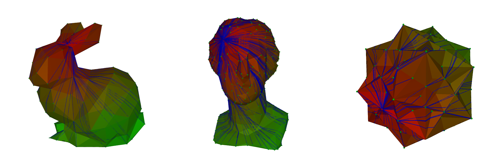

# Geodesic-Paths
Implementation of various algorithms to compute geodesic paths and distances on meshes.



This is a project for the class "Geometric Data Analysis" for the MVA Master at ENS Paris-Saclay. The report can be found [here](report/report.pdf).

## Algorithms
The following algorithms are implemented:
- Heat method
- Fast marching method
- Spectral embedding resistance distance transform
- Poisson equation border transform
- Improved Chen-Han algorithm

## Usage
The code is written in Rust and can be found in the `geopathic` directory. To run the code, you can use the following command:
```bash
cd geopathic
cargo run --release
```
This will run the main function, which demonstrates the usage of the implemented algorithms on a sample mesh. You can modify the code to test it on different meshes or to compute geodesic paths between different points.

The codebase implements a custom mesh viewer using the `kiss3d` crate, which allows you to visualize the meshes and the computed geodesic paths.

## Benchmarks
The performance of the implemented algorithms is benchmarked on various meshes, and the results are reported in the report.
They can be run using the following command:
```bash
cargo run --example bench_ich.rs
```
for the Improved Chen-Han algorithm, and similarly for the other algorithms by replacing `bench_ich.rs` with the corresponding benchmark file.

Plots can then be generated using the `plot_ich.py` script in the `benchmarks` directory (and similarly for the other algorithms).

